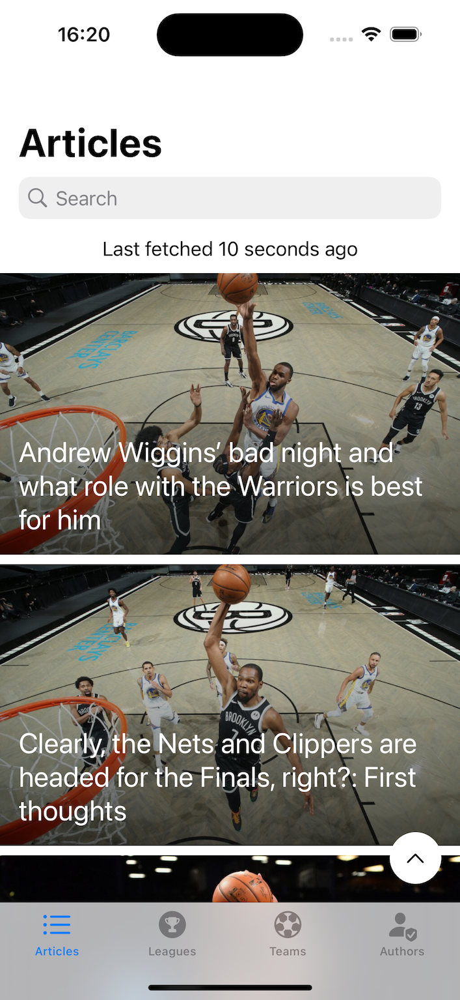
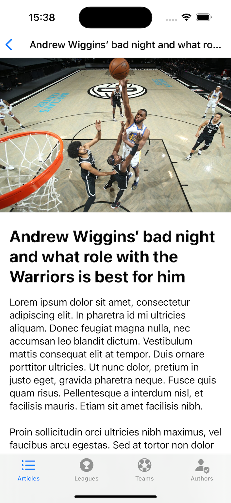
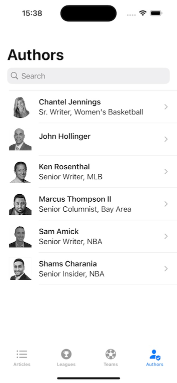

## Description
This is a demo application for showing Sports news. It is meant to run as a simple, standalone app that connects to a lightweight REST backend. 

It's implemented with an MVVM architecture using Swift, Async/Await, SwiftUI and Combine.

## Screenshots
#### Article List:

#### Article content:

#### Authors:
